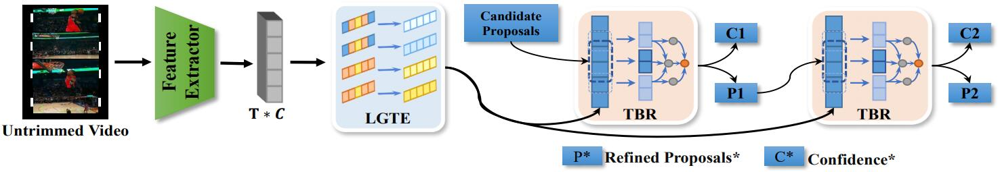

# Temporal Context Aggregation Network - Pytorch

This repo holds the pytorch-version codes of paper: "Temporal Context Aggregation Network for Temporal Action Proposal Refinement", which is accepted in CVPR 2021.

[[Arxiv Preprint]](http://arxiv.org/abs/2103.13141)

# Update

* 2021.05.31: Repository for TCANet


# Contents

* [Paper Introduction](#paper-introduction)
* [Other Info](#other-info)
* [Prerequisites](#prerequisites)
* [Code and Data Preparation](#Code_and_Data_Preparation)
* [Training and Testing  of TCANet](#Training_and_Testing_of_TCANet)

# Paper Introduction

 

Temporal action proposal generation aims to estimate temporal intervals of actions in untrimmed videos, which is a challenging yet important task in the video understanding field. The proposals generated by current methods still suffer from inaccurate temporal boundaries and inferior confidence used for retrieval owing to the lack of efficient temporal modeling and effective boundary context utilization. In this paper, we propose Temporal Context Aggregation Network (TCANet) to generate high-quality action proposals through "local and global" temporal context aggregation and complementary as well as progressive boundary refinement. Specifically, we first design a Local-Global Temporal Encoder (LGTE), which adopts the channel grouping strategy to efficiently encode both "local and global" temporal inter-dependencies. Furthermore, both the boundary and internal context of proposals are adopted for frame-level and segment-level boundary regressions, respectively. Temporal Boundary Regressor (TBR) is designed to combine these two regression granularities in an end-to-end fashion, which achieves the precise boundaries and reliable confidence of proposals through progressive refinement. Extensive experiments are conducted on three challenging datasets: HACS, ActivityNet-v1.3, and THUMOS-14, where TCANet can generate proposals with high precision and recall. By combining with the existing action classifier, TCANet can obtain remarkable temporal action detection performance compared with other methods. Not surprisingly, the proposed TCANet won the 1st place in the CVPR 2020 - HACS challenge leaderboard on temporal action localization task.

# Prerequisites

These code is  implemented in Pytorch 1.5.1 + Python3.

# Code and Data Preparation

## Get the code

Clone this repo with git, please use:

```
git clone https://github.com/qingzhiwu/Temporal-Context-Aggregation-Network-Pytorch.git
```


## Download Datasets

We support experiments with publicly available dataset HACS for temporal action proposal generation now. To download this dataset, please use [official HACS downloader](https://github.com/) to download videos from the YouTube.

To extract visual feature, we adopt Slowfast model pretrained on the training set of HACS. Please refer this repo [Slowfast](https://github.com/) to extract features.

For convenience of training and testing,  we provide the rescaled feature at here [Google Cloud](https://coming_soon) or [Baidu Yun](). 

# Training and Testing  of TCANet

All configurations of TCANet are saved in opts.py, where you can modify training and model parameter.


#### 1. Training of Boundary-Matching-Network(BMN)


```
python3 main_bmn.py --mode train
```

We also provide trained BMN model in `./checkpoint/`

#### 2. Testing of BMN

```
python3 main_bmn.py --mode inference
```

#### 3. Proposals generation

```
python3
```

#### 4. Training of TCANet

```
python3 main_tca.py --mode train
```

We also provide trained PEM model in `./checkpoint` .

#### 6. Testing of TCANet

```
python3 main_tca.py  --mode inference
```

#### 7. Post processing and generate final results

```
python3 main_tca.py
```

# Other Info

## Citation


Please cite the following paper if you feel TCANet useful to your research

```
@inproceedings{qing2021temporal,
  author    = {Qing, Zhiwu and 
               Su, Haisheng and 
               Gan, Weihao and 
               Wang, Dongliang and 
               Wu, Wei and 
               Wang, Xiang and 
               Qiao, Yu and 
               Yan, Junjie and 
               Gao, Changxin and 
               Sang, Nong},
  title     = {Temporal Context Aggregation Network for Temporal Action Proposal Refinement},
  booktitle   = {Computer Vision and Pattern Recognition},
  year      = {2021},
  }
```


## Contact
For any question, please file an issue or contact
```
Zhiwu Qing: qzw@hust.edu.cn
```
